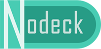

# nodeck


nodeck is based on [koajs](https://github.com/koajs/koa) to provide better Web MVC development experience.

## Getting Started

### Requirements

  * Mac OS X, Windows, or Linux
  * [Node.js](https://nodejs.org/) v5.0 or newer
  * `npm` v3.3 or newer (new to [npm](https://docs.npmjs.com/)?)

### Install
```sh
$ npm install nodeck-cli -g
$ ndeck init myapp && cd myapp
$ npm install
$ npm run dev
```

### Usage
```js
const Nodeck = require('nodeck');
const PORT = process.env.PORT || 4567;

const app = new Nodeck();

app.start(PORT).then(() => {
    console.log(`Server start and listen at ${PORT}`);
});
```
